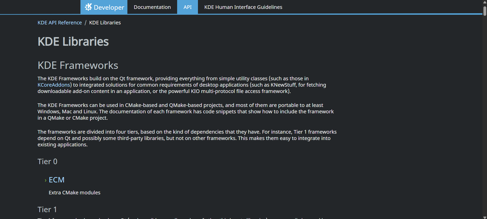
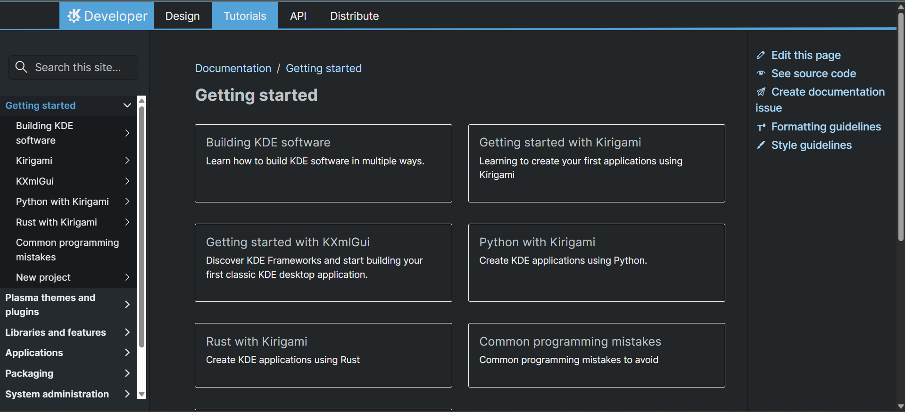
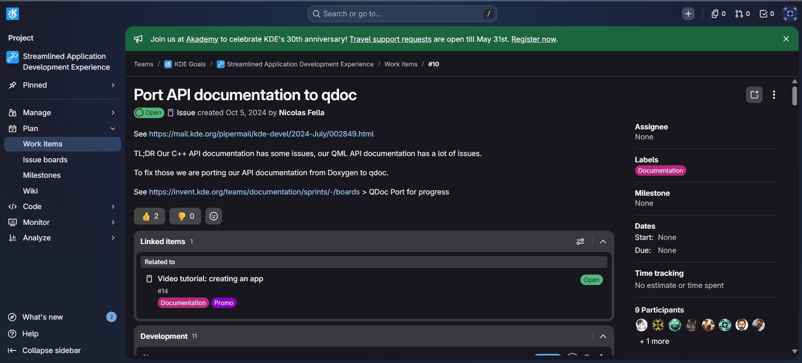

# Diário de Bordo – \[Lucas Martins Gabriel]

**Disciplina:** \[Gestão da Configuração e Evolução de Software]
**Equipe:** \[KDE Frameworks]
**Comunidade/Projeto de Software Livre:** \[KDE]

---

## Sprint 0 – \[06/04/2026 – 22/04/2026]

### Resumo da Sprint

Sprint dedicada ao onboarding completo no projeto KDE Frameworks. Realizei leitura detalhada do guia de contribuição e código de conduta da comunidade, criação de contas nas principais plataformas de colaboração (KDE Invent e Matrix), e exploração da arquitetura do KDE Frameworks. Estudei a organização de subprojetos divididos em 4 tiers de dependências e explorei projetos em desenvolvimento como o Language Bindings (Ship Frameworks via Pip).

### Atividades Realizadas

| Data   | Atividade                                            | Tipo (Código/Doc/Discussão/Outro) | Link/Referência         | Status    |
| ------ | ---------------------------------------------------- | --------------------------------- | ----------------------- | --------- |
| 06/04  | Leitura do guia de contribuição do KDE              | Estudo                            | [Get Involved](https://community.kde.org/Get_Involved)      | Concluído |
| 08/04  | Leitura e compreensão do código de conduta          | Estudo                            | [KDE Code of Conduct](https://kde.org/code-of-conduct/)     | Concluído |
| 10/04  | Criação de conta no KDE Invent                      | Configuração                      | [invent.kde.org](https://invent.kde.org)          | Concluído |
| 12/04  | Criação de conta no Matrix                          | Configuração                      | [matrix.org](https://matrix.org)              | Concluído |
| 15/04  | Exploração inicial da estrutura de subprojetos      | Estudo                            | [KDE Development Docs](https://develop.kde.org/docs/) e [KDE Frameworks](https://api.kde.org/)  | Concluído |
| 18/04  | Estudo do projeto Language Bindings                 | Estudo                            | [Ship Frameworks via Pip](https://community.kde.org/Development/Language_Bindings/Ship_Frameworks_via_Pip) | Concluído |
| 20/04  | Documentação do processo de onboarding              | Documentação                      | Este diário             | Concluído |

### Maiores Avanços

* Criação bem-sucedida de contas nas plataformas essenciais do KDE (Invent e Matrix).
* Compreensão das políticas de contribuição e código de conduta da comunidade KDE.
* Familiarização com a organização geral do projeto KDE Frameworks.
* Documentação estruturada do processo de onboarding para futuras referências.

### Maiores Dificuldades

* A estrutura de subprojetos do KDE Frameworks é complexa; foi desafiador compreender a organização.
* Dificuldade ao tentar acessar os canais do KDE no Matrix via homeserver matrix.org.

### Aprendizados

* Políticas de contribuição do projeto KDE e boas práticas de colaboração em comunidades open source.
* Código de conduta e responsabilidades éticas como membro da comunidade.
* Processo de autenticação e criação de contas em plataformas KDE (Invent e Matrix).
* Visão geral da arquitetura modular do KDE Frameworks e seus subprojetos.

### Evidências e Referências Visuais

Os seguintes prints documentam o processo de onboarding e exploração realizado:

#### KDE Invent - Grupos de Projetos

Estrutura de grupos disponíveis na plataforma (Accessibility, Automotive, Documentation, Education, Frameworks, Games, Graphics)

#### KDE Frameworks - Documentação de Tiers

Arquitetura modular do KDE Frameworks dividida em 4 tiers com suas respectivas dependências

#### KDE Developer Portal

Página inicial com guias de desenvolvimento (Getting Started, Building KDE, Kirigami, KXmlGui, Python, Rust)

#### KDE Community Wiki - Get Involved

Página de contribuição com informações sobre como contatar a comunidade e acessar Matrix

#### Ship Frameworks via Pip

Documentação do projeto "Ship Frameworks via Pip" para distribuição de frameworks via pip

#### Matrix - KDE Community

Estrutura de canais e salas da comunidade KDE no Matrix

### Plano Pessoal para a Próxima Sprint

- [ ] Estudar em profundidade a organização de pelo menos 2-3 subprojetos específicos do KDE Frameworks (ex: QtColorWidget, KAuth, KColorScheme)
- [ ] Encontrar e analisar uma issue para iniciantes em um dos subprojetos do KDE Frameworks
- [ ] Preparar o ambiente local para contribuir (clonar repositório, instalar dependências, executar testes)
- [ ] Realizar o primeiro commit ou pull request pequeno para ganhar experiência com o fluxo de contribuição
- [ ] Colaborar com outros membros da equipe: participar de revisão de código, fazer perguntas nos canais do Matrix/Invent

---

## Sprint 1 – \[24/04/2026 – 11/05/2026]

### Resumo da Sprint

Sprint dedicada a encontrar a primeira issue para contribuir. Analisei uma meta issue de documentação e escolhi a lib KWeatherCore para trabalhar, fiz o fork do repositório e comecei a estudar sobre como transferir a documentação da lib de doxygen para qdoc

### Atividades Realizadas

| Data   | Atividade                                            | Tipo (Código/Doc/Discussão/Outro) | Link/Referência         | Status    |
| ------ | ---------------------------------------------------- | --------------------------------- | ----------------------- | --------- |
| 09/05  | Leitura da meta issue                                | Estudo                            | [Port API documentation do qdoc](https://invent.kde.org/teams/goals/streamlined-application-development-experience/-/work_items/10)      | Concluído |
| 10/05  | Estudo inicial da lib kweathercore                   | Estudo                            | [KWeatherCore](https://invent.kde.org/libraries/kweathercore)     | Concluído |
| 10/04  | Fork da lib                                          | Configuração                      | [martinsglucas/kweathercore](https://invent.kde.org/martinsglucas/kweathercore)          | Concluído |
| 10/04  | Ver outra issue semelhante que já foi resolvida      | Estudo                            | [Krita](https://invent.kde.org/graphics/krita/-/work_items/76)             | Concluído |
| 12/04  | Documentação do processo de onboarding               | Documentação                      | Este diário             | Concluído |

### Maiores Avanços

* Ter achado a primeira issue para contribuir

### Maiores Dificuldades

* Repositórios dos framworks sem tag de issues para iniciantes, o que dificulta a busca por uma issue para começar a contribuir

### Aprendizados

* Objetivo da comunidade KDE em melhorar a documentação das libs

### Evidências e Referências Visuais

Os seguintes prints documentam a busca pela primeira issue e o processo de fork realizado:

#### Meta Issue - Port API documentation do qdoc

Esse é o objetivo geral da meta issue, que envolve a transferência da documentação de doxygen para qdoc

#### Estudo da lib KWeatherCore

Página da lib KWeatherCore, que é o projeto escolhido para contribuir

Documentação atual da lib KWeatherCore, que utiliza doxygen e precisa ser transferida para qdoc

#### Fork do repositório

Página do meu fork do repositório da lib KWeatherCore, onde irei realizar as contribuições

### Plano Pessoal para a Próxima Sprint

- [ ] Estudar em profundidade a estrutura da documentação atual da lib KWeatherCore
- [ ] Analisar o guia de contribuição específico para documentação do KDE
- [ ] Iniciar a transferência da documentação de doxygen para qdoc
- [ ] Realizar o primeiro commit e abrir um pull request para revisão
- [ ] Participar da revisão do código e fazer ajustes conforme o feedback recebido

---
